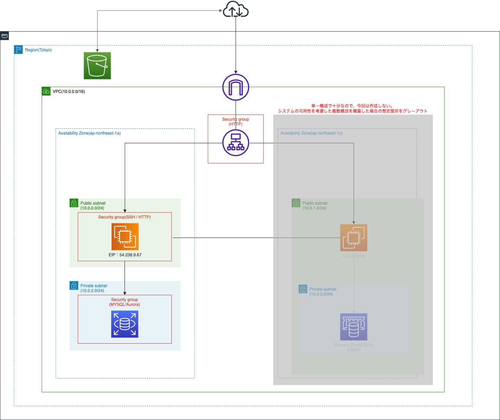

# 2022/07年度　AWSフルコース 第5回

## 課題内容
* EC2上にサンプルアプリケーションをデプロイして、動作させてください。
* サンプルは第3回で案内済みのものを使ってください。
* まずは組み込みサーバーだけで、動作したらサーバーアプリケーションを分けて動くかチャレンジしてみましょう。動作したら、ELB(ALB)を追加してみましょう。
* ELB を加えて動作が確認できたら、さらに S3 を追加してみましょう。S3 をどのように使うかはお任せします。

.png "確認3")
.png "確認4")
.png "確認5")

* ここまでが問題無く動作したら、その環境を構成図に書き起こしてください。
